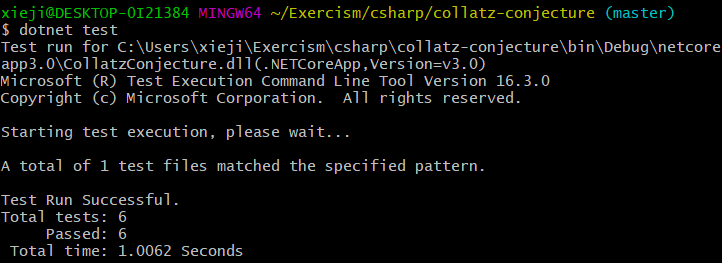

# Collatz Conjecture

The Collatz Conjecture or 3x+1 problem can be summarized as follows:

Take any positive integer n. If n is even, divide n by 2 to get n / 2. If n is
odd, multiply n by 3 and add 1 to get 3n + 1. Repeat the process indefinitely.
The conjecture states that no matter which number you start with, you will
always reach 1 eventually.

Given a number n, return the number of steps required to reach 1.

## Examples

Starting with n = 12, the steps would be as follows:

0. 12
1. 6
2. 3
3. 10
4. 5
5. 16
6. 8
7. 4
8. 2
9. 1

Resulting in 9 steps. So for input n = 12, the return value would be 9.

## Running the tests

To run the tests, run the command `dotnet test` from within the exercise directory.

Initially, only the first test will be enabled. This is to encourage you to solve the exercise one step at a time.
Once you get the first test passing, remove the `Skip` property from the next test and work on getting that test passing.
Once none of the tests are skipped and they are all passing, you can submit your solution 
using `exercism submit CollatzConjecture.cs`

## Further information

For more detailed information about the C# track, including how to get help if
you're having trouble, please visit the exercism.io [C# language page](http://exercism.io/languages/csharp/resources).

## Source

An unsolved problem in mathematics named after mathematician Lothar Collatz [https://en.wikipedia.org/wiki/3x_%2B_1_problem](https://en.wikipedia.org/wiki/3x_%2B_1_problem)

## Result

